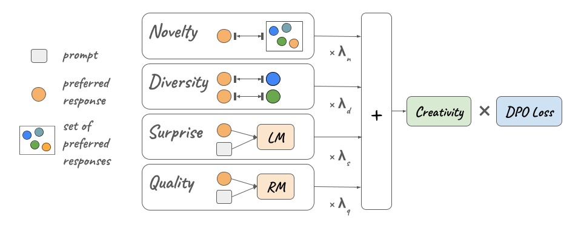

# Creative Preference Optimization



[](https://arxiv.org/abs/2505.14442)
[](https://mete.is/creative-preference-optimization)
[](LICENSE)

This repo contains the code for the creative preference optimization (CrPO) framework. Models & Data can be found in [HuggingFace](https://huggingface.co/collections/CNCL-Penn-State/crpo-67d0b11ff358430823dbb3df).

## Installation

```bash
pip install -r requirements.txt
pip install -e .
```

## Reproducibility
`experiments` directory contains scripts to reproduce the SFT, DPO training and evaluation.

## Citation
```
@misc{ismayilzada2025creativepreferenceoptimization,
      title={Creative Preference Optimization}, 
      author={Mete Ismayilzada and Antonio Laverghetta Jr. and Simone A. Luchini and Reet Patel and Antoine Bosselut and Lonneke van der Plas and Roger E. Beaty},
      year={2025},
      eprint={2505.14442},
      archivePrefix={arXiv},
      primaryClass={cs.CL},
      url={https://arxiv.org/abs/2505.14442}, 
}
```
